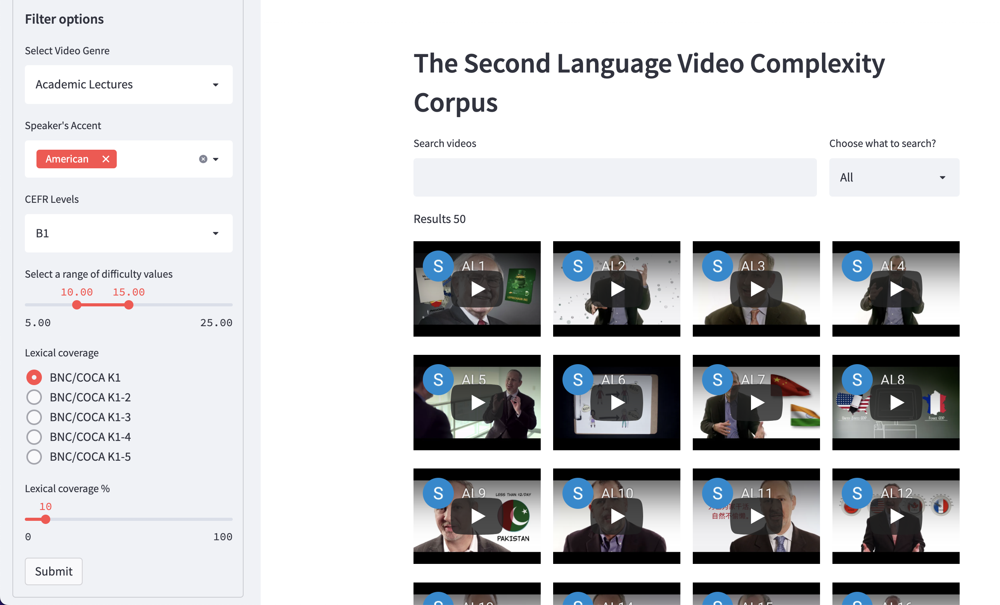

# The Second Language Video Complexity Corpus 

The SLVC corpus consists of 320 instructional videos and 320 government advertainment. The videos in the corpus were rated for their difficulties by 322 intermediate English language learners. The corpus is licensed under the creative commons CC BY-NC-ND. 

